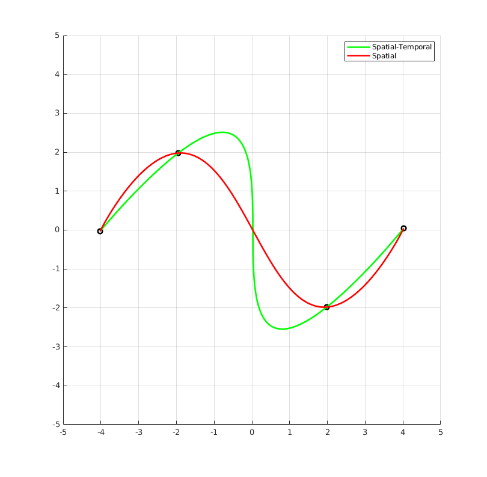
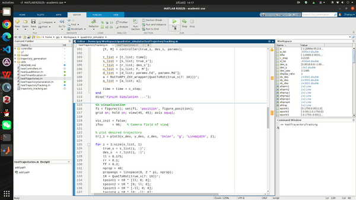
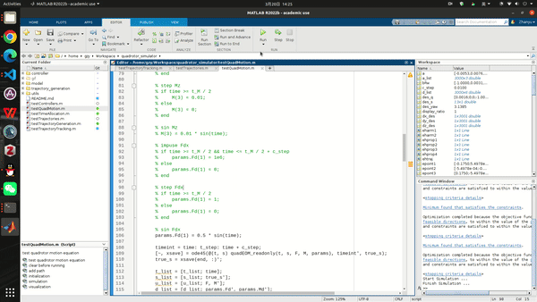
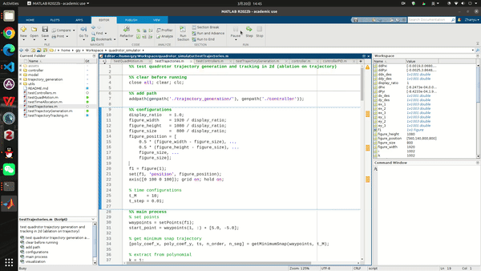
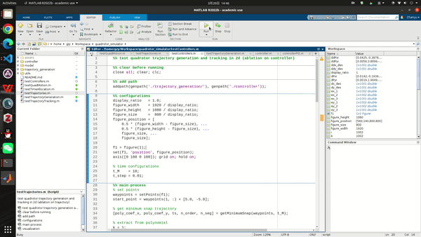

# Quadrotor Simulator
Hello and welcome to Quadrotor Simulator. We make it in `MATLAB`. Thanks the following contributors:
- Qin Yetong
- Liu Peijiang

## Quick Start
### Requirements
- Optimization Toolbox
- Control System Toolbox

### File Tree
```
.
├── assets
├── controller
├── model
├── trajectory_generation
├── utils
├── README.md
├── testControllers.m
├── testQuadMotion.m
├── testTimeAllocation.m
├── testTrajectories.m
├── testTrajectoryGeneration.m
└── testTrajectoryTracking.m
```

All the files in the root can be run directly.

### Explanation
1. `testTrajectoryGeneration.m`.

   

   You can set waypoints using the cursor in order, and press ENTER to finish setting. And then, it will calculate and show the minimum-snap, line interpolation and polynomial fitting trajectory.

2. `testTimeAllocation.m`.

   

   You can set waypoints like `testTrajectoryGeneration.m`. And then, it will calculate and show the spatial-temporal and spatial trajectory. The spatial trajectory has the same time allocation for each piece of trajectory.

3. `testTrajectoryTracking.m`
   
   

   You can set waypoints using cursor, and then input z(height) in the command line. Finally, press ENTER to finish setting. Subsequently, it will first generate a minimum-snap trajectory and then begin the simulation using a simple linear PID controller.

4. `testQuadMotion.m`

   

   You can change the input type in the file. In this file, it will test the model response to different inputs. The quadrotor model can be found in `./model/`.

5. `testTrajectories.m` & `testControllers.m`

   

   

   They are the previous of this reposity. We make it in our course project. They test different trajectory generation methods (minimum-snap, line interpolation and polynomial fitting) and different controllers (PID and LQR) in 2D space.


